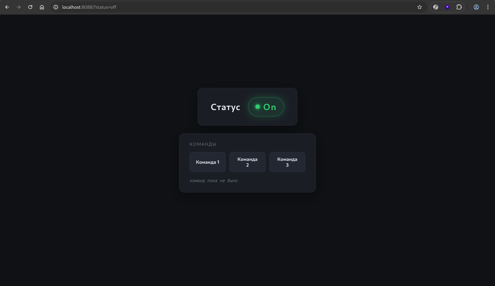
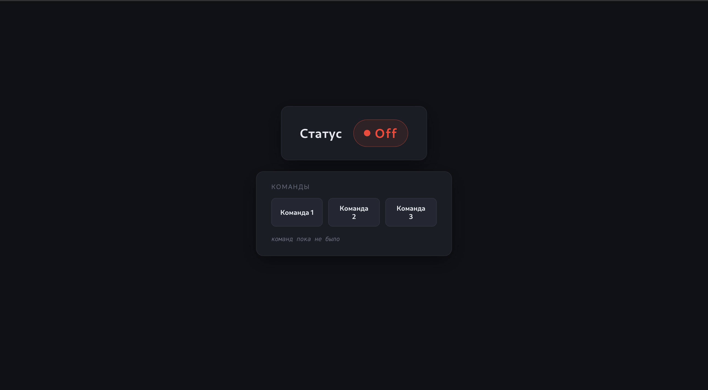
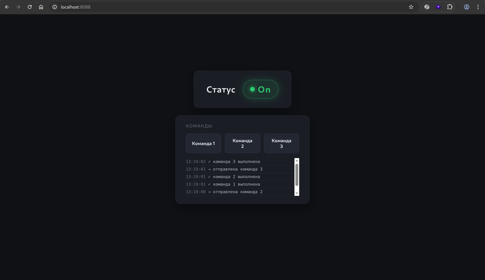

## Скриншоты

Включённое состояние:



Выключенное cостояние:



Выполненных команд:



## Как запустить

Требуется Go 1.22+.

```bash
git clone git@github.com:AlexeyM0L/robo-ruka.git
cd robo-ruka
cp .env.example .env
go run ./cmd/server
```

По умолчанию сервер слушает `http://localhost:8080`.

### Конфигурация

`.env` (пример в `.env.example`):

| Переменная       | По умолчанию       | Назначение              |
|------------------|--------------------|-------------------------|
| `HOST`           | `localhost`        | Хост                    |
| `PORT`           | `8080`             | Порт                    |
| `TEMPLATE_PATH`  | `web/index.html`   | Путь до HTML-шаблона    |
| `STATE_PATH`     | `state.txt`        | Файл с текущим статусом |

### Сборка бинаря

```bash
go build -o server ./cmd/server
./server
```

