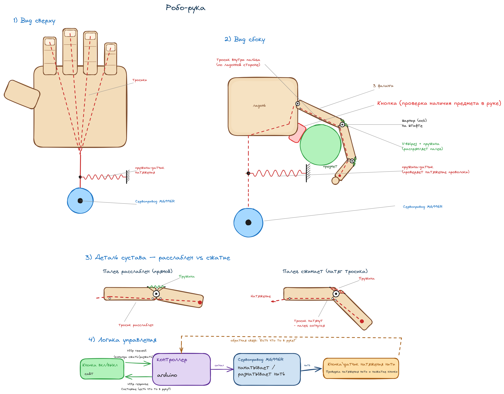

# robo-ruka

## Макет руки



## Схема и аппаратная часть

### 1. Как работает

Пальцы приводятся в движение тросиками. Один сервопривод наматывает общую
нить — она тянет тросики, и пальцы сгибаются. Пружины в суставах распрямляют
пальцы обратно, когда нить ослаблена. Натяжение нити отслеживает датчик, который
и замыкает цикл управления.

Цепочка управления:

1. **Браузер** отправляет HTTP-запрос с командой сжать/разжать.
2. **Контроллер (Arduino)** превращает команду в сигнал для сервопривода.
3. **Сервопривод MG996R** наматывает или разматывает нить, двигая пальцы.
4. **Кнопка / датчик натяжения** измеряет натяжение нити и проверяет, есть ли
   что-то в руке.
5. Контроллер получает обратную связь («есть что-то в руке?») и при достаточном
   натяжении останавливает сервопривод, а в HTTP-ответ возвращает состояние.

### 2. Механика и материалы

- **Тросики** — тонкая нить/леска, проложенная по ладонной стороне через
  фаланги пальцев.
- **Шарниры** — дают пальцам сгибаться.
- **Пружины** — возвращают палец в прямое положение.
- **Сервопривод** — один привод MG996R наматывает общую нить всех пальцев.
- **Пружина-датчик натяжения** — отслеживает натяжение нити для обратной связи.
- **Кнопка** — фиксирует наличие предмета в захвате.

### 3. Примерная стоимость

| Компонент                        | Кол-во      | Ориентировочная цена |
|----------------------------------|-------------|----------------------|
| Каркас (ладонь и пальцы)         | 1 комплект  | 200–800 ₽            |
| Сервопривод MG996R               | 1 шт.       | 300–700 ₽            |
| Контроллер Arduino (Uno/Nano)    | 1 шт.       | 500–1500 ₽           |
| Кнопка (датчик наличия предмета) | 1 шт.       | 30–150 ₽             |
| Пружина-датчик натяжения         | 1 шт.       | 50–300 ₽             |
| Тросики (леска)                  | комплект    | 50–200 ₽             |
| Пружины для пальцев              | 4 шт.       | 50–200 ₽             |
| Шарниры                          | набор       | 100–400 ₽            |
| Блок питания                     | 1 шт.       | 300–700 ₽            |
| **Итого**                        |             | **1600–4900 ₽**      |

## Скриншоты

Включённое состояние:


Выключенное cостояние:


Выполненных команд:


## Как запустить

Требуется Go 1.22+.

```bash
git clone git@github.com:AlexeyM0L/robo-ruka.git
cd robo-ruka
cp .env.example .env
go run ./cmd/server
```

По умолчанию сервер слушает `http://localhost:8080`.
При первом запуске рядом автоматически создаётся файл базы данных `robo-ruka.db`.

### Конфигурация

Настройки читаются из переменных окружения (можно положить в `.env`, пример — в `.env.example`):

| Переменная       | По умолчанию       | Назначение                       |
|------------------|--------------------|----------------------------------|
| `HOST`           | `localhost`        | Хост                             |
| `PORT`           | `8080`             | Порт                             |
| `TEMPLATE_PATH`  | `web/index.html`   | Путь до HTML-шаблона             |
| `DB_PATH`        | `robo-ruka.db`     | Путь до файла базы данных SQLite |

### Сборка бинаря

```bash
go build -o server ./cmd/server
./server
```

## База данных

В качестве хранилища использовал **SQLite** — это БД, которая живёт в одном
файле. Драйвер для работы с базой данных на Go — `modernc.org/sqlite`.

Одна таблица с одной строкой:

```sql
CREATE TABLE IF NOT EXISTS status (
    id    INTEGER PRIMARY KEY,
    value TEXT NOT NULL  -- "on" или "off"
);
```

Запись делается через upsert (`INSERT ... ON CONFLICT(id) DO UPDATE`):
если строки ещё нет — она создаётся, если есть — обновляется.


## Архитектура

```
HTTP-запрос
   |
handler   ── разбирает запрос, рендерит HTML
   |
service   ── бизнес-логика и валидация
   |
repository ── работа с базой данных (SQLite)
   |
domain
```

Внешние слои не зависят от внутренних, что позволяет беспрепятственно переходить от одной базы данных к другой, не ломая логику всей программы.

### Что за что отвечает

| Файл                                | Слой       | Назначение                                                                 |
|-------------------------------------|------------|----------------------------------------------------------------------------|
| `cmd/server/main.go`                | точка входа| Читает конфиг, открывает БД, собирает слои вместе и запускает HTTP-сервер. |
| `internal/config/config.go`         | конфиг     | Читает настройки из окружения/`.env` (хост, порт, путь к БД и шаблону).    |
| `internal/domain/status.go`         | domain     | Тип `Status` (`on`/`off`) и его разбор (`ParseStatus`). Без зависимостей.  |
| `internal/repository/repository.go` | repository | Интерфейс `Status` (`Get`/`Set`) и сборка репозиториев.                    |
| `internal/repository/sqlite.go`     | repository | Открытие БД и создание таблицы (`NewDB`).                                   |
| `internal/repository/status.go`     | repository | Чтение/запись статуса в SQLite.                                            |
| `internal/service/service.go`       | service    | Интерфейс сервиса статуса и его сборка.                                     |
| `internal/service/status.go`        | service    | Логика: валидирует ввод и обращается к репозиторию.                         |
| `internal/service/errors.go`        | service    | Доменные ошибки сервиса (`ErrInvalidStatus`).                              |
| `internal/handler/http.go`          | handler    | HTTP-обработчик `/`: меняет статус по `?status=on/off` и рендерит шаблон.  |
| `web/index.html`                    | web        | HTML-шаблон страницы с тумблером.                                          |

### Как всё связано

В файле `main.go` вызываются и пробрасываются зависимости при старте программы.

```go
db, _ := repository.NewDB(cfg.DBPath)   // открыли SQLite
repo := repository.NewRepository(db)    // репозиторий поверх БД
svc  := service.NewService(repo)        // сервис поверх репозитория
h    := handler.New(svc, tmpl)          // handler поверх сервиса
```

Дальше при запросе `GET /?status=on`:
`handler` берёт параметр -> зовёт `service.Update` -> тот валидирует через `domain.ParseStatus`
и сохраняет через `repository.Set` → ответ рендерится из `web/index.html`.
Если параметра нет — текущий статус читается через `repository.Get`.
